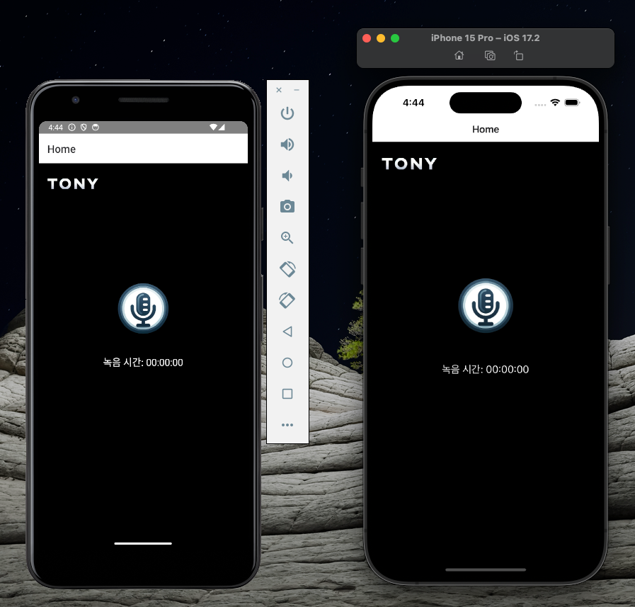

# react-native_voice_recorder

이 프로젝트는 React Native로 구축되었으며, 음성 녹음 기능을 제공하여 재생 기능/AWS S3로 업로드하는 기능을 제공합니다.

## Prerequsite

### 1. [Environment Setup](https://reactnative.dev/docs/environment-setup)

- React Native CLI Quickstart
- RN version = 0.73
- ruby version >= 3.0.0

### 2. Create S3 Bucket


## Run


### 1. S3 환경 설정
```shell
[Settings.js] 파일에 S3 설정 수정
export const S3_OPTION = {
  keyPrefix: '',  // 'S3 bucket prefix ex) reco/' 
  bucket: '',     // 'bucket name'
  region: '',     // 'region ex) ap-northeast-2'
  accessKey: '',  // 'access key'
  secretKey: '',  // 'secret key'
  successActionStatus: 201,   // 'success code'
}
```

### 2. 실행
```shell
npm i

npm start 

i # ios simulator 실행
a # android emulator 실행
```

  

### 3. 디바이스 실행
- https://reactnative.dev/docs/running-on-device

## Reference

- [루비 버전 이슈 해결](https://velog.io/@k0310kjy/rbenv-Ruby-%EB%B2%84%EC%A0%84-%EB%B0%94%EA%BE%B8%EA%B8%B0)
- [React Native Docs](https://reactnative.dev/docs/getting-started)
- [React Native Permissions](https://github.com/zoontek/react-native-permissions)
- [React Native File System](https://github.com/itinance/react-native-fs)
- [Nativewind Docs](https://www.nativewind.dev/quick-starts/react-native-cli)
